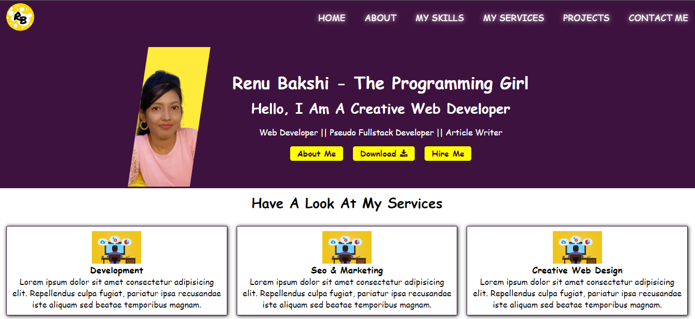
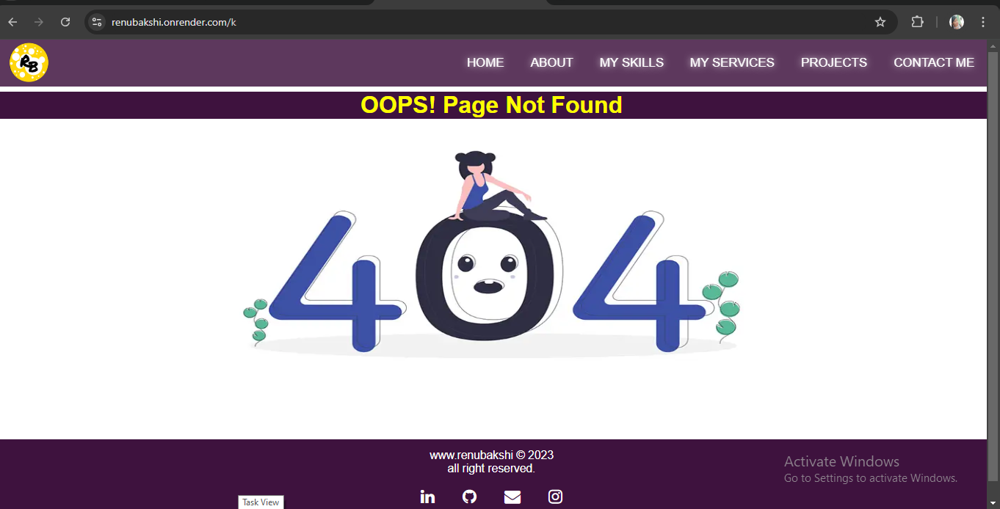

# Skill Spectrum - Portfolio Website

## 📷 Screenshots



## 🌐 Live Demo
Check out the live version of my portfolio [Skill-Spectrum](https://renubakshi.onrender.com/).

## 🛠 Technologies Used
- **Frontend:** HTML, CSS, JavaScript
- **Backend:** Node.js, Express.js
- **Database:** MongoDB

## ✨ Features
- Responsive design for various devices.
- Portfolio sections include Home, About, My Services, Skills, Projects, and Contact.
- Contact form to directly send me messages.
- Projects page to showcase my work, with details and live demo links.

## 🚀 How to Run the Project Locally
1. Clone the repository:
    ```bash
    git clone https://github.com/Renubakshi/your-repo-name.git
    ```
2. Navigate to the project directory:
    ```bash
    cd your-repo-name
    ```
3. Install dependencies:
    ```bash
    npm install
    ```
4. Start the server:
    ```bash
    npm start
    ```
5. Open the browser and go to `http://localhost:8000` to see the website.

## 💻 Projects
Here are some of the projects showcased on the portfolio:
1. **ClimaCity** - A weather app built using React, Material UI, and Vite.
   - [Live Demo](https://renubakshi.github.io/climacity)
   - [GitHub](https://github.com/Renubakshi/climacity)

2. **Pattern Prodigy** - A Simon Says game that challenges players to remember color patterns.
   - [Live Demo](https://renubakshi.github.io/pattern-prodigy)
   - [GitHub](https://github.com/Renubakshi/pattern-prodigy)

3. **Simple Calculator** - A basic calculator built using HTML, CSS, and JavaScript.
   - [Live Demo](https://renubakshi.github.io/simple-calculator)
   - [GitHub](https://github.com/Renubakshi/simple-calculator)

## 🤝 Connect with Me
- [LinkedIn](https://www.linkedin.com/in/renubakshi)
- [GitHub](https://github.com/Renubakshi)

Feel free to explore my projects and reach out if you'd like to collaborate!
